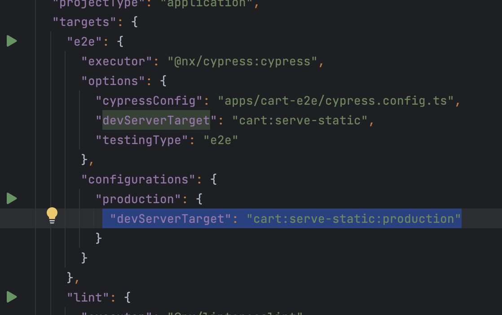
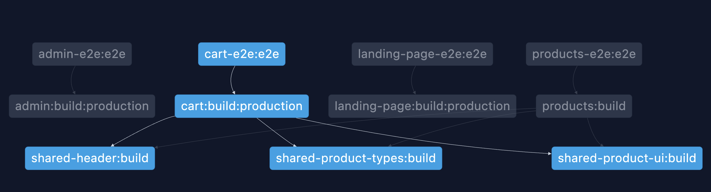

# NxCloud CI example repo

This repo is based on the [Nx Examples](https://github.com/nrwl/nx-examples) repo 
but setup in a way to illustrate some of the benefits of using Nx and NxCloud together to setup CI.

The e2e targets are setup to serve the app statically from dist:



this is how the apps are served statically:

```json
    "serve-static": {
      "executor": "@nrwl/web:file-server",
      "options": {
        "buildTarget": "cart:build"
      }
    },
```

This then results in this project graph:



The DTE solution can then be explained as such: https://youtu.be/NZF0ZJpgaJM?si=gLpTnTdygB1gx7wI&t=516

[Here is an example DTE config](.github/workflows/ci.yml) that is applicable to most CI providers.

In the above yaml, if you remove the line that activate DTE:

```yaml
# - run: npx nx-cloud start-ci-run --stop-agents-after="e2e"
```

it will go from finishing in 3 minutes, to finishing in 9 minutes. That is because we can now parallelise the tasks across machines.
So it also illustrates the CI time savings we get from DTE.
